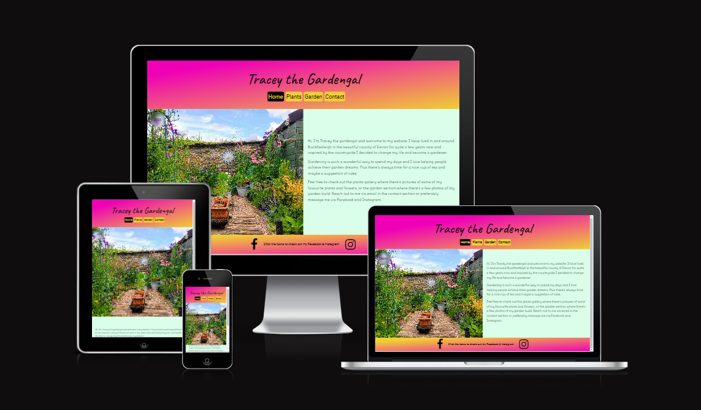
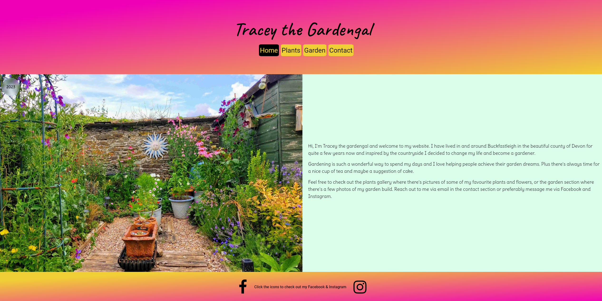
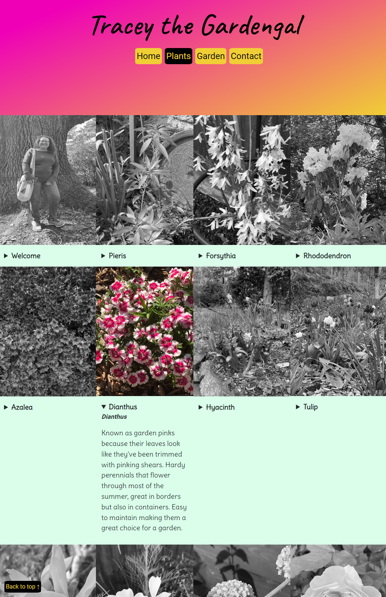
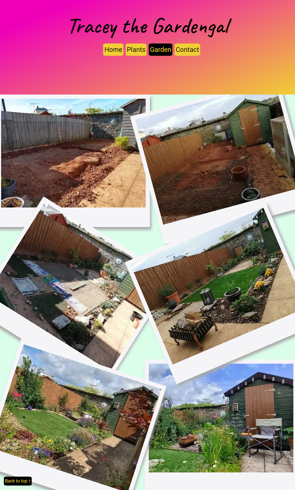
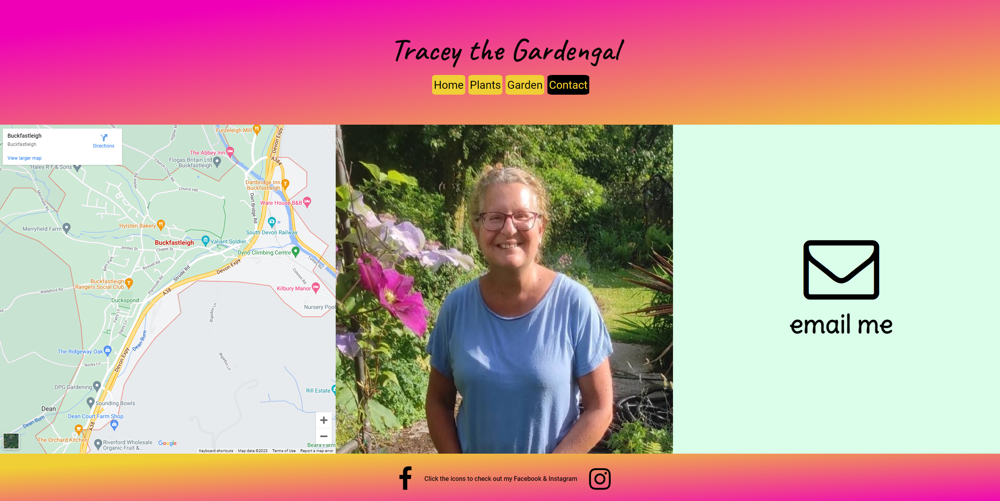
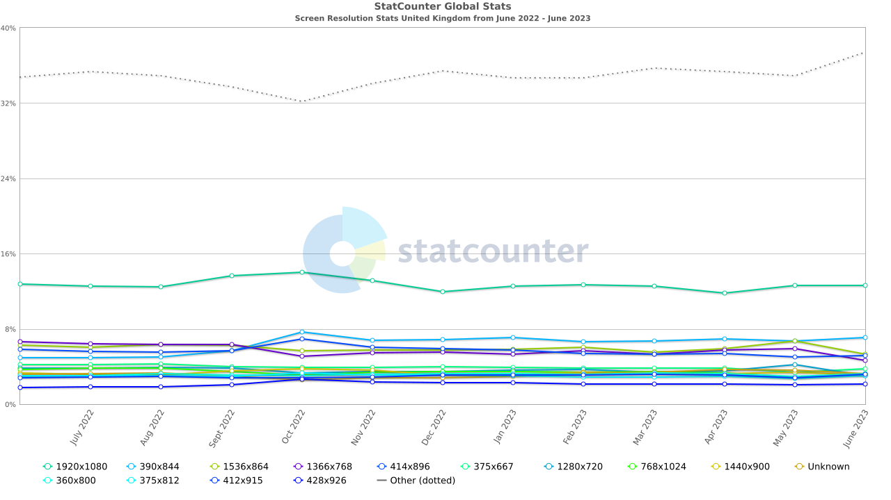
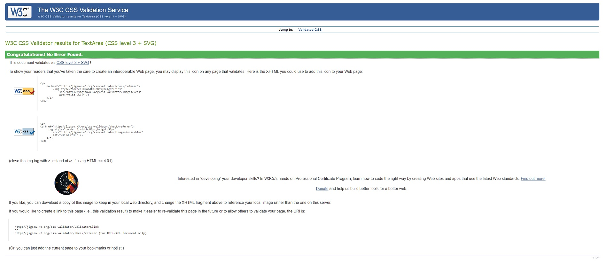
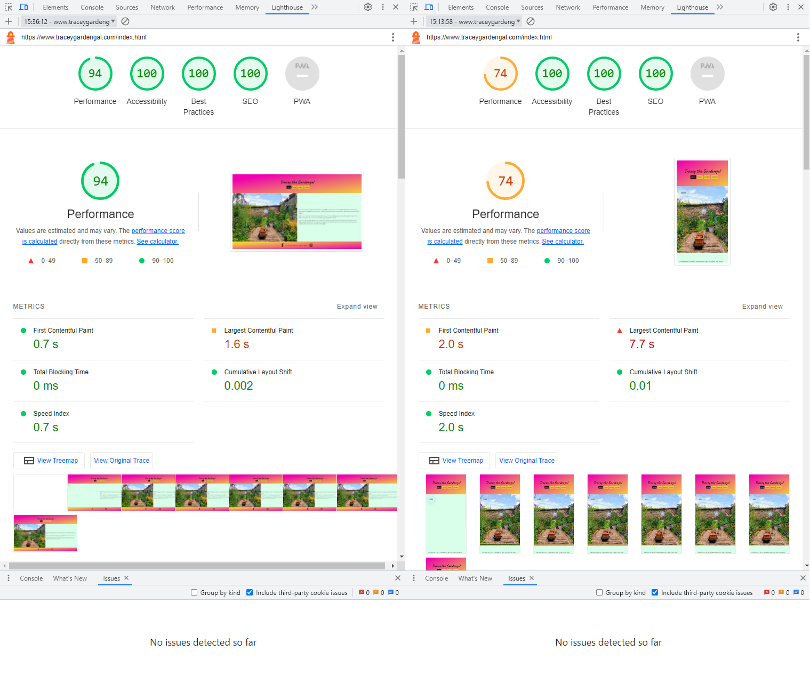

# Tracey the Gardengal

## Table of contents ##

1. [Tracey the Gardengal](#Tracey-the-Gardengal)
2. [Website construction, testing and deployment](#Website-construction-testing-and-deployment)
3. [The 4-page design and what each page does and why](#The-4-page-design-and-what-each-page-does-and-why)
4. [Features](#Features)
  1.  [Existing features](#Existing-features)
    1.  [Colour palette](#Colour-Palette)
    2.  [The images used](#The-images-used)
    3.  [The header](#The-header)
    4.  [The home page](#The-home-page)
    5.  [The footer](#The-footer)
    6.  [Plants gallery](#Plants)
    7.  [Garden gallery](#Garden)
    8.  [The contact page](#The-contact-page)
  2.  [Features-left-to-implement](#Features-left-to-implement)
5.  [Testing](#Testing)
6.  [Known issues with the site](#Known-issues-with-site)
7.  [Validator testing](#Validator-testing)
8.  [Lighthouse testing](#Lighthouse-testing)
9.  [Unfixed bugs](#Unfixed-bugs)
10.  [Deployment](#Deployment)
11. [Credits](#Credits)
12. [Content](#Content)
13. [Media](#Media)

# Tracey the Gardengal

My wife has, over the past three years or so, built a successful garden business having decided to quit her safe but boring office job of ten years plus. She generates her business through word of mouth with a small part coming from Facebook, it's probably a 90/10 split in favour of word of mouth. She has also just started on Instagram but what is really needed is something that she can get her existing clients to give to potential new clients as an introduction. Something for potential new clients to have a look at before they speak to her or she contacts them. 

Tracey the Gardengal's website took shape from this simple idea. Together we discussed the format, basic layout and exactly what my wife wanted the site to do. Wireframing was done by hand on a sheet of A4 as it was just easier for us and given that we are husband and wife a lot more comfy that way sitting on our sofa. I have included an image of the hand drawn wireframes for reference purposes. The wireframes show the initial 3-page setup, the 4th page was added later during the build. Also the header/footer shows a clear divide between the purple and yellow colours whereas the final build has a blended effect. There's also no hint of the green that was eventually used as the background colour as it was only during the build that it became apparent that white as the background colour was just too plain. It was also very important that the site works just as well on mobile devices as on laptops/desktops as more and more people even in the age demographic, mostly retirees, that my wife predominantly deals with are just using a mobile device to access the internet.

[Wireframe](assets/img/wireframe.png)

## Website construction testing and deployment

In order to code the website I used a combination of VS Code and Stackblitz IDE's. The main code was written, tested and debugged in VS Code as I have found this IDE to be one of the most fully featured environments currently available. Stackblitz was used to build and test small portions of the code before moving the code over to VS Code. The reason for this is that Stackblitz has a useful 'party trick' in that the preview browser displays the code in real time meaning you can see how the code looks and behaves instantly. (nb. I have since discovered that you can now do this in VS Code by installing the 'live preview' extension from Microsoft). By adopting a reductionist approach to the code build this allowed me to debug in 'bitesize' chunks and thus reduce the risk of any major issues getting into the build as it was constructed.

The testing of the site as a whole was completed using a combination of the desktop browsers Chrome v114.0.5.5735.198, Firefox v114.0.2 and Edge v114.0.1823.67 on my Win 11 Pro desktop PC, mobile Safari on my Wife's iPhone 11 and mobile Chrome on my Android Nothing Phone(1). I also made extensive use of the devtools built into Chrome desktop browser.

To give the site great responsive behaviour across phone, tablet, laptop and desktop screens I took the decision to use the CSS library Bootstrap as there seemed little point in 'reinventing the wheel' and building this from scratch. Three appropriate fonts, Caveat, Delius and Roboto were imported from Google Fonts and the Facebook, Instagram and email icons were imported from Font Awesome V4.7. The colour scheme was picked using Adobe Colour Wheel and based around the main colour purple, my wife's favourite colour. All the images used are genuine photos shot on my wife's iPhone 11 or my Nothing Phone(1) as my wife felt that photos from the gardens she tends would give the site a more authentic feel.

Deployment of the site is via Github pages with a regular commit/push history available as these were always undertaken at key stages throughout the development period. As the site uses only HTML & CSS there was no need to add a git ignore file.

## The 4-page design and what each page does and why

My wife wanted a simple straightforward site design and it was agreed that a 4-page design would meet this brief by presenting all relevant information without being unwieldy or difficult to navigate. The header/footer design used across the site gives a vibrant splash of colour with a nice flourish being the graded colour moving from purple to yellow diagionally across these sections but with the colours reversed in the footer so they run from yellow to purple. The green used has had its opacity reduced to soften it and make it much more pastel in look. Another flourish is the gallery that is presented as a series of black and white images that turn to colour when hovered over/selected really drawing your eye to the image. Information about the selected plant/flower is presented via the use of the details element in HTML. Again Bootstrap enabled this feature albeit customised to better suit the look of the site. The third page, which was added later in the build is another gallery but shows the complete landscaping of a garden (our garden) and is presented as a series of retro looking photos. It provides a nice contrast to the plants gallery and showcases the breadth of my wife's gardening abilities. The fourth page is a simple contact me section with an option to email tracey in addition to the social media links contained in the footer. My wife did not want her phone number to be available on the site to prevent any unnecessary/spam calls. As the site is for a genuine business I did not want to add in any form sections as this would require a backend to work correctly plus my wife had clearly stated that she wants contact through social media/email only. A nice touch with the email is the use of mailto: to provide a easy way to launch an email client. There is also the option to click on the Facebook/Instagram icons ever present in the footer to be taken to my wife's social media accounts. There is a custom icon present in the title of each page. This icon is a photo taken by Tracey of an Osteospermum flower and the colours of this flower ie. purple/orange mimic the purple/yellow used for the main site.

## Features 

### Existing features

- ### Colour palette

Tracey decided straight away that her favourite colour, purple, should feature throughout the site. In order to give the site a strong identity it was agreed that a limited colour palette should be used. There are only five colours used throughout the site. The primary site colours of purple, yellow and green were picked using Adobe's colour wheel. These colours are complimentary and work very well together. The purple and yellow have been used without modification with the green being softened using the rgba command allowing a reduced opacity. It was decided that rather than using the blue from the colour wheel a slightly different shade, the official Facebook/Meta light blue would be used when hovering over the icons in the footer. The final colour is black for the navbar and the text throughout the site to give maximum contrast for legibility and accessibility.

- ### The images used

It was also discussed and decided upon that all the images used throughout the site needed to be from Traceys's work or home and were shot using either my wife's iPhone 11 or my Nothing Phone(1). In keeping with the idea that the site is an introduction to my wife's passion for gardening it was felt that stock/professional pictures would not suit the site ethos. This feature brings an honesty and integrity to the images used.

- ### The header

  - The way the colours in the header blend together going from purple in the top left to yellow in the bottom right was done to soften the header which could have looked a bit too much if it had been one solid colour.
  - The fonts, Caveat, Delius and Roboto by Google, were chosen to give a handwritten feel to the title text with Caveat that is in keeping with the 'homegrown' ethos of the site. Caveat was considered too 'handwritten' for the homepage text so Delius was used instead with the navbar using the nice clean modern Roboto font. Should the fonts fail to load sans-serif is used as a backup.
  - Featured on all four pages, the use of customised bootstrap buttons really pulls the navigation bar to the fore, making it easy to see and very obvious as to what it does. The use throughout the site of a limited but very well chosen colour palette, discussed above, means that it's nigh on impossible to lose your way on the site and helps achieve the goal of user-friendly, intuitive navigation.
  - The navbar remains consistent across all devices from mobile to desktop screens. This was a concious design decision as I feel that the almost ubiquitous hamburger menu that is employed these days is a classic example of poor ux design and should be avoided.

- ### The home page

  - The home page includes a picture of Tracey's own garden in Buckfastleigh, with a animation that initially draws the eye to the garden.
  - The 'about me'part of the homepage gives a little bit of background to Tracey's decision to become a gardener and the passion that she has for the job.
  - Included in the 'about me' part is an explanation of what each part of the site does.

- ### The footer 

  - Rather than repeat the exact colour blend of the header the decision to reverse the blend so that it is yellow to purple from top left to bottom right gives a nice contrast to the header whilst maintaining colour consistency. 
  - Putting the Facebook and Instagram icons in the footer and having them as links to those sites makes it very easy for people to navigate there and contact Tracey. Having them in the footer means they are present on all four pages of the site.

- ### Plants

  - The plants gallery is the main focus of the site and allows Tracey to display images of some of her favourite plants and flowers with a brief description for each available underneath. The gallery is presented in black and white with the selected picture transforming to colour really drawing the visitors eye to that particular image. There is also an image of the gardengal herself with an introduction to the gallery.
  - This section is valuable to the user as every gardener Tracey has ever met loves looking at and talking about pictures of plants and flowers.

  

- ### Garden 

- When we first moved to Buckfastleigh the garden was just a typical new build garden ie. a boring lawn and nothing else. This series of photos shows the transformation of the garden into something a lot more interesting than just a lawn.
- A completely different kind of gallery compared to the plant gallery, showing a different aspect to gardening that of landscaping. Presented in a very different style from the plant gallery with it made to look like a series of retro photographs.

- ### The contact page

  - In addition to the icons in the footer that are present throughout the site the contact section adds a clickable email icon that launches an email window allowing potential clients to contact Tracey this way. It also shows another image of the gardengal and includes an embedded interactive Google map that shows Buckfastleigh allowing people an opportunity to check out how far they are from the Tracey's location. This is important in a rural setting where people may not be completely familiar with a location and it's surrounding area. 

## Features left to implement

- As the site is complimentary to Tracey's word of mouth business model there are no further features to implement and the site is considered complete whilst acknowledging that the plant gallery will need updating from time to time keep abreast of current plant/flower trends and Tracey's changing taste in plants/flowers.

## Testing 

My testing of this site has, I believe, been as thorough as it can be. Each part of the build was built first in Stackblitz IDE allowing me to build 'bitesize' chunks of code and test them before adding them into my main code built using VS Code IDE. I do my development work using a 27" QHD Iiyama monitor allowing me to ensure that it presents itself well when viewed on a very hi-res monitor. I also have a secondary Iiyama 24" 1080p monitor allowing me to further check how the site presents itself at a resolution that I think more people use. However the design was conducted from a mobile forward viewpoint so extensive use was made of Chrome devtools and devtools' ability to mimic a wide range of devices from mobile phones to tablets. Devtools has a responsive mode where you can change the resolution to whatever you want and I used this to mimic a few other resolutions such as 1368*768 which is also a quite common monitor resolution. The devices modelled were the iPhone SE, iPhone XR, iPhone 12 Pro, Moto G Power, Kindle Fire HD, Galaxy Fold, Google Nest Hub, Google Nest Hub Pro, iPad, iPad Air, iPad Mini, iPad Pro, Samsung Galaxy S8+, Surface Pro 7 and Surface Duo. In addition to these virtual devices I tested extensively using Chrome on my Android Nothing Phone(1) and Safari on my wife's iPhone 11. Desktop browsers used for testing were Chrome v114.0.5.5735.198, Firefox v114.0.2 and Edge v114.0.1823.67. There are of course a multitude of different browsers out there and it is difficult to guarantee behaviour across all of them, but I believe that a good variety of devices have been tested for including phones, tablets, folding phones and desktops and the most common browsers have been tested with the exception maybe of desktop Safari. The responsive test (link included earlier in this readme) does model Apple devices and this includes Safari on an iMac and given that the site responds well on this test site I have no reason to believe there would be any issues for anyone using an Apple computer. 

Each breakpoint in Bootstrap was thoroughly tested with various customisations made to my code to ensure that the site maintains its integrity regardless of the device used to view it. Additional breakpoints have been added to ensure not only that the site looks good at all likely viewing resolutions but also that it maintains this integrity whether the device used is in portrait mode or landscape mode. The various texts from header, footer and main body of pages adjusts accordingly and where possible the units used for describing height and width are not fixed ie px for pixels but more responsive units such as % (percentage), or dvh (dynamic viewport height). Where these cannot be used such as with embedded Google maps which insists on px pixels a class and wrapper have been custom created to give a measure of responsiveness.

I also got friends involved and asked them to view the website and give feedback as other people can often see something that's been missed and their feedback was used to make further modifications to the resonsiveness of the site. A special mention need to be made to Richard Kraft, a fellow student and a web developer who offered to look at the site and give constructive feedback. This feedback was invaluable in getting the site to where it is now.

During testing the main issues were overspill of text from the homepage into the header and footer, overspill of the photos in the garden section into the header and footer and poor presentation including overspill of the website title, navbar buttons and the text on the site when viewed on a mobile device in landscape mode. There was also an issue with the large email icon sitting behind the Google map when viewed on a mobile device in landscape mode and an issue with the image on the contact page not presenting correctly, again when a device is in landscape mode. All of these issues have been corrected with the email icon and image being removed from landscape mode but being present in portrait mode. Adjustments were made to font sizes at various breakpoints and of the three paragraphs of text on the homepage, one paragraph is removed under certain conditions to eliminate overspill as I did not want scrollbars to be used as I feel that this is a poor user experience.

I realised at the last minute of testing/checking that there was a serious flaw with the flow being used when applying media queries. The media queries were not in the correct order and when corrected breakpoints had to be rewritten and then minor bugs solved due to the refined flow. It was at this point that I adjusted how I approached the whole question of responsiveness. I realised that trying to make the site work on every available device was simply too time consuming and that I should work smarter and not harder. I used a stats site called statcounter and looked at the most widely used screen resolutions in the UK between 06/2022 to 06/2023. Based on these stats I tested the sites responsiveness against the resolutions mapped thus ensuring that the site works with the most commonly used devices. By focussing on screen resolutions and not specific devices this ensures that my testing moved from being device specific ie. using Chrome devtools device models to being device agnostic ie. using the Chrome devtools responsive options. This does mean that it is possible that the site will not present itself correctly on some devices but as I consider these devices to be outliers in that not many people will be using them I think it is a better way overall to test this site's responsiveness. Outlier devices include folding phones and smart devices such as Google's Nest Hub plus any other devices with less common screen resolutions.

## Known issues with site

1.  There is an issue with embedded Google maps and accessibility as it is not readable by current screen readers. this is a known issue and a Google search highlights this. I still felt that it was a good idea to include the embedded map but equally important to highlight this issue. One that hopefully Google can address in the not too distant future.

2. Google maps also only allows pixels to be used to define width and height which creates an issue with getting a properly responsive embedded map. This was overcome using custom code but again it would be better if the responsiveness was 'baked in' by Google.

3.  During the deployemnt of the build it has also become apparent that Gitpages doesn't always update correctly when using a custom domain name. Hence the need to revert to the standard address for the site on occasion throughout the build and deployment. Once the build has been finalised then the site will use the custom domain 'traceygardengal.com' as this is a better and more professional address for my wife's website and definitely much preferred than giving the standard gitpages website address to potential clients.

4.  As mentioned previously there is potentially issues around site presentation on less popular devices such as home hubs and folding phones. The site was also tested only on the most common desktop browsers and this means that the site may not present correctly on some of the less popular choices.

## Validator testing 

- HTML
  - No errors were returned when passing the home page through the official [W3C validator](https://validator.w3.org/nu/?doc=https%3A%2F%2Fwww.traceygardengal.com%2Findex.html)
  - No errors were returned when passing the gallery page through the official [W3C validator](https://validator.w3.org/nu/?doc=https%3A%2F%2Fwww.traceygardengal.com%2Fgallery.html)
  - No errors were returned when passing the garden page through the official [W3C validator](https://validator.w3.org/nu/?doc=https%3A%2F%2Fwww.traceygardengal.com%2Fgarden.html)
  - No errors were returned when passing the contact page through the official [W3C validator](https://validator.w3.org/nu/?doc=https%3A%2F%2Fwww.traceygardengal.com%2Fcontact.html)
 
- CSS
  - No errors were found when passing the css code by direct imput through the official [(Jigsaw) validator](https://jigsaw.w3.org/css-validator/validator)
    

## Lighthouse testing

Further to being put through the necessary W3C validations for HTML and CSS The site was tested using Lighthouse in Chrome dev tools. This tool checked the site for performance, accessibility, best practices and seo.

1. Performance, the site scored 95/100 for desktop performance and 74/100 for mobile performance with no errors being reported. Lighthouse advises that there is a risk of [FOIT](https://developer.chrome.com/docs/lighthouse/performance/font-display/?utm_source=lighthouse&utm_medium=devtools) (flash of invisible text) during webfont load. However this refers to the icons used from the CDN Font Awesome and as there are no default system icons this advisory is acknowledged but ignored. The only other advisory is about [serving static assets with an efficient cache policy.](https://developer.chrome.com/docs/lighthouse/performance/font-display/?utm_source=lighthouse&utm_medium=devtools). This suggests that on repeated visits to a site the time it takes to load the site can be sped up by caching assets such as images. Again whilst acknowledging this there is no need to implement this as the site loads quickly enough using it's current settings.
2. Accessibility, the site scored 100/100 for desktop and mobile in this category with no errors being reported.
3. Best practices, the site scored 100/100 for desktop and mobile in this category with no errors being reported.
4. SEO (Search Engine Optimisation), the site scored 100/100 for desktop and mobile in this category with no errors being reported.

## Unfixed bugs

There are no unfixed bugs that am I am aware of. Testing has been very thorough throughout the build.

## Deployment 

- The site was deployed to GitHub pages. The steps to deploy were as follows: 
  - In the GitHub repository, navigate to the Settings tab 
  - From the Source section drop-down menu, select the Master Branch
  - Once the Master Branch has been selected, the page will be automatically refreshed with a detailed ribbon display to indicate the successful deployment. 
  - In custom domain 'www.traceygardengal.com' has been saved with a successful DNS check as the site address needs to better reflect my wife's business.

The live link can be found here - [Tracey the Gardengal](https://www.traceygardengal.com/index.html) 

The Github repository can be found here - [thespamster/the-lady-gardener](https://github.com/thespamster/the-lady-gardener/tree/main)

## Credits 

- A special thank you to [Richard Kraft](https://www.linkedin.com/in/richardjohnkraft/), a fellow student and software developer, for taking timeout from his busy schedule to offer advice, support and feedback as I tackled my first project.
- A big thank you to my Code Institute mentor seun_mentor(KoKo) for her invaluable feedback.
## Content 

- Responsive site code courtesy of Bootstrap, [Bootstrap v5.3 - CSS library](https://getbootstrap.com/)
- The glass effect used on the homepage to highlight the year of the home page image courtesy of Glassism, [Creates a glass effect using CSS](https://css.glass)
- The Facebook, Instagram & Email icons courtesy of Font Awesome, [Font Awesome v4.7 - Icons](https://fontawesome.com/v4/)

- Other sites used to help with the build,

- To create the favicon for the title bar, [Convert.app](https://convert.app/)
- To get the colour selection right, [Adobe Color - Colour Wheel](https://color.adobe.com/create/color-wheel)
- Conversion of jpeg format images to webp to help with site responsiveness,[Convertio - Convert JPEG to WEBP](https://convertio.co/jpg-webp/)
- Compression of images used to help with site responsiveness, [Compress images for website](https://compressnow.com/)
- Purchase of the 'traceygardengal.com' domain, [Custom domain for website](https://domains.google.com/)
- Custom Google fonts to improve the look of the text on the site, [Google Fonts](https://fonts.google.com/)

## Media

- All images used were shot on my wife's iPhone 11 or my Android Nothing Phone(1) avoiding any copyright issues.

[Back to the top](#Tracey-the-Gardengal)
